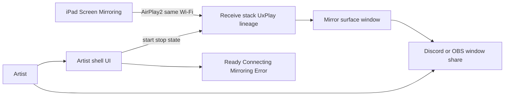
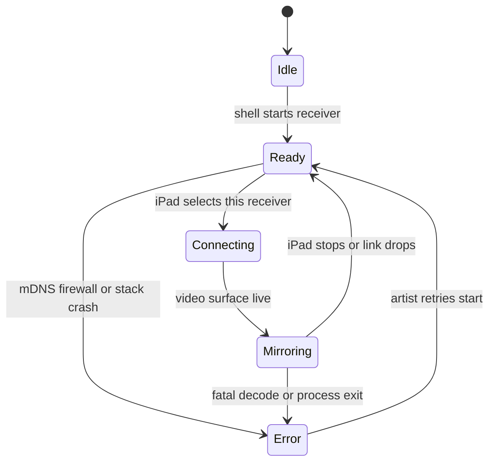

# iPad Windows Mirror for Artists - Plan

**Target repo:** new private greenfield repo (working name `artist-mirror`); not `testdata-generator`.
This plan file may live in another workspace for CE discovery; all **Files:** paths below are relative to the new app repo.
**Product Contract preservation:** Product Contract unchanged (R/A/F/AE/KD IDs preserved).

## Goal Capsule

- **Objective:** Ship a free Windows app that mirrors an iPad screen over the same Wi‑Fi into a clean, shareable window so artists can show art progress in Discord, OBS, and similar tools.
- **Product authority:** This plan owns v1 mirror-receive UX on Windows only. Built-in streaming platforms, multi-OS, and tablet-input modes are out of active scope.
- **Open blockers:** None. Deferred naming/branding and bilingual UI do not block implementation.

---

## Product Contract

### Summary

A free, eventually open-source Windows receiver with a simple, good-looking UI that shows a live iPad AirPlay mirror in one window.
Artists share that window from Discord, OBS, or other capture tools; the app itself does not log into stream platforms.

### Problem Frame

Artists who draw on iPad often want others to see progress live.
Paid mirror apps add cost and friction; raw open-source receivers work but feel unfriendly for non-technical artists.
The gap is not “another stream encoder” — it is a trustworthy, pretty, one-purpose mirror window on Windows.

### Key Decisions

- KD1. **Mirror-only product** — no built-in Twitch/YouTube/Discord stream buttons. (session-settled: user-directed — chosen over stream-suite: Discord/OBS remain the sharing tools.) Governs R1, R6.
- KD2. **Windows-only v1** — Mac/Linux later if ever. (session-settled: user-directed — chosen over multi-OS: faster first artist-ready release.) Governs R2.
- KD3. **Same Wi‑Fi / home network first** — classic local AirPlay path. (session-settled: user-directed — chosen over cross-network: realistic for AirPlay v1.) Governs R3.
- KD4. **Open source later, private until it works** — develop closed, publish when usable. (session-settled: user-directed — chosen over public-from-day-one: ship quality before exposure.) Governs R7.
- KD5. **UI-shell over proven AirPlay receive stack** — prefer wrapping/adapting an existing receiver (e.g. UxPlay lineage) over rewriting the protocol. (session-settled: user-approved — chosen over full custom receiver: reach “it works” for artists sooner.) Governs R4, R8.

### Actors

- A1. **Artist (primary)** — draws on iPad, runs the Windows app, shares the mirror window.
- A2. **Viewer** — watches via Discord call, OBS stream, or similar; never uses this app directly.

### Requirements

**Core receive**

- R1. The app shows a live mirror of an iPad screen in a single primary window on Windows.
- R2. v1 runs as a normal Windows desktop app installable by a non-developer artist.
- R3. Connection assumes iPad and PC are on the same local Wi‑Fi / home network.
- R4. The iPad can discover and connect using standard screen-mirroring (AirPlay-style) without a paid third-party mobile app on the iPad.

**Artist UX**

- R5. First-run and reconnect flows are understandable without a terminal or manual command flags.
- R6. The mirror window is suitable to share: clean chrome, readable state (connecting / ready / mirroring / error), and easy for Discord or OBS to pick as a window source.
- R7. The product is free for artists; no paywall, watermark, or forced account for core mirroring.

**Distribution & openness**

- R8. While private, the project may use open-source receiver code under its license terms; when published, the release is open source and license-compliant (including GPL obligations if GPL code is shipped).
- R9. A cold artist can go from download → app open → iPad connected → shareable window without reading developer docs.

### Key Flows

- F1. First successful mirror
  - **Trigger:** Artist installs and opens the app on Windows.
  - **Actors:** A1
  - **Steps:** App shows ready-to-receive state; artist starts Screen Mirroring on iPad and picks this receiver; mirror appears in the app window; artist shares that window in Discord or OBS.
  - **Outcome:** Live art progress visible to viewers via the artist’s chosen share tool.
  - **Covered by:** R1, R4, R5, R6, R9

- F2. Reconnect after drop
  - **Trigger:** Wi‑Fi blip or iPad stops mirroring.
  - **Actors:** A1
  - **Steps:** App shows a clear disconnected/error state; artist restarts mirroring from iPad; session resumes without reinstall or terminal recovery.
  - **Outcome:** Artist recovers without support chat.
  - **Covered by:** R5, R6

### Acceptance Examples

- AE1. Discord share
  - **Covers R1, R6.**
  - **Given:** App is mirroring the iPad.
  - **When:** Artist uses Discord screen share and selects this app’s window.
  - **Then:** Viewers see the iPad content (art canvas progress) without needing a second mirror app.

- AE2. No paid iPad companion
  - **Covers R4, R7.**
  - **Given:** Artist has only stock iPadOS Screen Mirroring.
  - **When:** They connect to this Windows receiver on the same Wi‑Fi.
  - **Then:** Mirroring works without installing a paid companion on the iPad.

- AE3. Non-technical first run
  - **Covers R5, R9.**
  - **Given:** Artist has never used AirPlay receivers before.
  - **When:** They open the app and follow on-screen cues.
  - **Then:** They reach a mirroring session without opening a terminal.

### Success Criteria

- An artist can complete F1 in one sitting on a typical home Wi‑Fi setup.
- The shared window looks intentional (not a raw debug console) when shown in Discord or OBS.
- Core mirroring has no payment or account gate.

### Scope Boundaries

**In v1**

- Windows receiver + live mirror window for same-network iPad Screen Mirroring.
- UX aimed at artists sharing progress (Discord, OBS, similar).

**Deferred for later**

- Mac/Linux builds.
- Cross-network / travel use.
- Built-in stream destination logins (Twitch, YouTube, Discord bot, etc.).
- Overlays, layouts, timers, tip jars, or full stream suites.
- Using the iPad as a drawing tablet for PC apps.

**Outside this product’s identity**

- Monetized freemium mirror with watermarks.
- Competing as a general “replace OBS” tool.

### Dependencies / Assumptions

- Assumption: Standard iPadOS Screen Mirroring to a third-party receiver remains possible on current iPadOS for local network use.
- Assumption: A maintained open-source AirPlay receive stack can be packaged for Windows under a compatible open-source license.
- Dependency: Artists still use Discord, OBS, or another share/capture tool for the actual broadcast.

---

## Planning Contract

### Assumptions

- Confirmed-by-silence after scoping: code lives in a **new private repo**, not inside `testdata-generator`.
- Confirmed-by-silence: build a **custom artist-facing shell** on the UxPlay lineage rather than only redistributing [uxplay-windows](https://github.com/leapbtw/uxplay-windows); that project is prior art to study, not the product name.
- Confirmed-by-silence: v1 enables **video + audio** when the receive stack provides them; UI may expose mute later but need not for MVP.
- Working title `artist-mirror` until branding is chosen; rename is cosmetic.
- Default UI language **English** for first public release; German strings can follow without changing architecture.

### Key Technical Decisions

- KTD1. **Receive stack = UxPlay lineage (GPLv3)** — vendor or link [FDH2/UxPlay](https://github.com/FDH2/UxPlay) / compatible lib (e.g. libuxplay patterns from uxplay-windows), do not reimplement AirPlay. (session-settled product KD5 → how: Governs R4, R8.) When public: ship GPLv3-compliant sources for the combined work.
- KTD2. **Native desktop shell, not Electron** — use a native UI toolkit that can own or tightly attach the mirror surface (Qt or equivalent Windows-native path). Avoid a separate ugly debug window as the only shareable surface.
- KTD3. **Stable shareable window identity** — one predictable window title/class for Discord/OBS picker; prefer a single primary surface over tray-only capture.
- KTD4. **Process lifecycle owned by the shell** — start/stop/restart receive from UI; surface firewall/mDNS failure as artist-readable errors, not terminal logs.
- KTD5. **Private repo until smoke-green** — no public GitHub until F1 works on a clean Windows 10/11 machine; LICENSE still present in-repo from day one for GPL compliance readiness.

### High-Level Technical Design





### Output Structure

```text
artist-mirror/                    # new private repo root
  README.md                       # artist quickstart + Discord/OBS tip
  LICENSE                         # GPLv3 (or compatible) from day one
  NOTICE                          # third-party attributions
  docs/
    artist-smoke-checklist.md     # manual F1/F2 verification
  app/                            # shell UI project
  receiver/                       # vendored or submodule receive stack + Windows build
  packaging/                      # installer / portable layout notes
  tests/
    shell/                        # unit tests for state machine / lifecycle
```

### Implementation Units sequencing

U1 → U2 → U3 → U4 → U5 → U6 (U4 can overlap late U3; U6 starts once U3 has a runnable shell).

---

## Implementation Units

### U1. Greenfield repo bootstrap

- **Goal:** Create the private app repo with license, README skeleton, and folder layout so GPL-ready development can start immediately.
- **Requirements:** R7, R8
- **Dependencies:** none
- **Files:**
  - `README.md` (create)
  - `LICENSE` (create)
  - `NOTICE` (create)
  - `docs/artist-smoke-checklist.md` (create stub)
  - `.gitignore` (create)
- **Approach:**
  1. Initialize private git repo named working title `artist-mirror`.
  2. Add GPLv3 LICENSE and NOTICE placeholders for UxPlay/GStreamer attributions.
  3. Document same-Wi‑Fi + Discord/OBS window-share intent in README (no fake screenshots yet).
- **Test scenarios:**
  - Test expectation: none -- scaffolding and license text only.
- **Verification:** Repo clones clean; LICENSE present; README states free + mirror-only + Windows.

### U2. Windows receive stack build path

- **Goal:** Produce a reproducible Windows build of the UxPlay-lineage receiver that can accept an iPad Screen Mirroring session on the same LAN.
- **Requirements:** R1, R3, R4
- **Dependencies:** U1
- **Files:**
  - `receiver/` (create — vendored sources, submodule, or documented fetch + patches)
  - `receiver/README.md` (create — MSYS2/UCRT or chosen toolchain steps)
  - `NOTICE` (modify — stack + GStreamer + mDNS credits)
- **Approach:**
  1. Study FDH2/UxPlay Windows/MSYS2 docs and leapbtw/uxplay-windows / libuxplay packaging patterns as prior art.
  2. Choose one integration mode: library link vs managed child process with controllable window title — prefer the mode that lets the shell meet KTD2/KTD3 with least fragility.
  3. Prove raw receive works on a test PC before investing in polish UI.
- **Execution note:** Smoke-first — get an iPad session on screen before refining UI chrome.
- **Patterns to follow:** Upstream UxPlay Windows build notes; do not invent a new AirPlay protocol.
- **Test scenarios:**
  - Happy path: With receiver running via documented build, iPadOS Screen Mirroring lists the receiver on same Wi‑Fi and shows video (Covers AE2).
  - Error path: Receiver started with Wi‑Fi off / wrong network → no false “mirroring” state; failure is observable.
  - Edge: Stop mirroring from iPad → receive process returns to waiting without requiring PC reboot.
- **Verification:** Documented build produces a runnable receiver; one successful iPad mirror captured in the smoke checklist.

### U3. Artist shell — lifecycle and states

- **Goal:** Ship a native Windows shell that starts/stops the receiver and shows Ready / Connecting / Mirroring / Error without a terminal.
- **Requirements:** R2, R5, R9
- **Dependencies:** U2
- **Files:**
  - `app/` (create — shell project)
  - `tests/shell/` (create — state/lifecycle tests)
- **Approach:**
  1. Implement the state machine from High-Level Technical Design.
  2. Wire Start / Stop / Retry actions to the receive stack (KTD4).
  3. Map stack/process failures to short artist-facing messages (firewall, discovery, crash).
- **Patterns to follow:** KTD2 native toolkit; keep chrome calm and dark-friendly for art streams without gimmicky overlays.
- **Test scenarios:**
  - Happy path: Start from Idle → Ready without throwing uncaught UI errors.
  - Happy path: Simulated “session active” signal → Mirroring state label updates.
  - Error path: Kill receive process while Ready → Error state + Retry returns to Ready attempt.
  - Edge: Rapid Start/Stop does not leave orphan receive processes.
  - Covers AE3.: First-run copy mentions Screen Mirroring + same Wi‑Fi in the Ready state.
- **Verification:** Shell alone can start/stop receive; states match checklist; unit tests cover transitions.

### U4. Shareable mirror surface

- **Goal:** Ensure the live mirror is presented in a Discord/OBS-friendly window (stable title, clean look).
- **Requirements:** R1, R6
- **Dependencies:** U3
- **Files:**
  - `app/` (modify — window chrome / embedding)
  - `docs/artist-smoke-checklist.md` (modify — Discord + OBS picker steps)
- **Approach:**
  1. Enforce KTD3: stable window title such as the product working name.
  2. Prefer single primary surface; hide developer clutter from the shared region.
  3. Confirm Discord and OBS can select that window while mirroring.
- **Test scenarios:**
  - Covers AE1.: With mirroring active, Discord window picker lists the stable title and shared output shows iPad content.
  - Happy path: OBS “Window Capture” can target the same window.
  - Edge: Resize shell while mirroring does not permanently lose the video surface (recover or keep painting).
- **Verification:** Smoke checklist Discord + OBS steps signed off on one Windows 10/11 machine.

### U5. Packaging for non-developers

- **Goal:** Deliver an installable or portable Windows build an artist can run without MSYS2.
- **Requirements:** R2, R9
- **Dependencies:** U3, U4
- **Files:**
  - `packaging/` (create)
  - `README.md` (modify — download/install section)
- **Approach:**
  1. Bundle required runtime libs (GStreamer plugins, mDNS helper as required by chosen stack).
  2. Provide installer and/or portable zip; first-run notes for Windows Firewall allow prompts.
  3. Keep private release artifacts until smoke-green (KTD5).
- **Test scenarios:**
  - Happy path: Clean Windows VM or second PC install from artifact → Ready state without installing MSYS2.
  - Error path: First launch firewall prompt → after allow, discovery works (or Error copy tells artist what to allow).
  - Edge: Uninstall / delete portable folder leaves no broken autostart (if autostart is offered, make it opt-in).
- **Verification:** Cold-machine install completes F1 using only README + in-app copy.

### U6. Release readiness — checklist, attribution, private→public gate

- **Goal:** Codify “it works” criteria and the later open-source publication gate.
- **Requirements:** R7, R8
- **Dependencies:** U5
- **Files:**
  - `docs/artist-smoke-checklist.md` (modify — complete F1/F2)
  - `NOTICE` (modify — final third-party list)
  - `README.md` (modify — contributing/source note for future public release)
- **Approach:**
  1. Fill smoke checklist for F1, F2, AE1–AE3.
  2. Verify NOTICE/LICENSE match shipped binaries (GPLv3 source offer path when public).
  3. Document the human gate: do not open the repo until checklist passes on a clean PC.
- **Test scenarios:**
  - Covers F2 / AE3.: Checklist includes reconnect-after-drop and zero-terminal first run.
  - Integration: NOTICE lists UxPlay + required media/mDNS components present in the package.
- **Verification:** Maintainer can tick the checklist; public-release section exists but repo stays private until then.

---

## Verification Contract

| Gate | What “pass” means |
|------|-------------------|
| Shell unit tests | `tests/shell` state/lifecycle tests pass on CI or local |
| Receive smoke | U2 scenario: iPad mirrors to built receiver on same Wi‑Fi |
| Artist smoke | `docs/artist-smoke-checklist.md` F1 + F2 + Discord/OBS picker completed |
| Cold install | U5 artifact runs Ready→Mirror on a machine without dev toolchain |
| License gate | LICENSE + NOTICE match shipped stack before any public release |

Automated AirPlay protocol tests are not required for v1; real iPad hardware (or equivalent client) is the source of truth for R1/R4.

---

## Definition of Done

- All units U1–U6 complete with their verifications.
- Product Contract R1–R9 satisfied for Windows same-Wi‑Fi mirror + shareable window.
- No paywall/account/watermark on core mirroring.
- Repo still private until smoke checklist passes; LICENSE/NOTICE ready for later public GPLv3 release.
- Deferred items (Mac/Linux, cross-network, built-in streaming, tablet mode) remain out of tree.

---

## Risks & Dependencies

| Risk | Mitigation |
|------|------------|
| iPadOS / AirPlay client changes break third-party receivers | Pin upstream UxPlay version; smoke on current iPadOS before release; track upstream |
| Windows mDNS/firewall blocks discovery | First-run Error copy + README firewall steps; optional bundled mDNS approach per prior art |
| GStreamer/plugin bloat in installer | Ship minimal plugin set needed for mirror; document size |
| Prior art overlap with uxplay-windows | Differentiate on artist copy, share-window UX, and calm UI — do not claim to invent AirPlay |
| GPL compliance when opening the repo | Keep LICENSE/NOTICE current; publish corresponding source with binaries |

**External dependencies:** FDH2/UxPlay (GPLv3), GStreamer ecosystem, Windows mDNS/Bonjour-compatible discovery as required by the chosen build.

---

## Open Questions

**Deferred (non-blocking)**

- Final product name and iconography.
- German localization timing.
- Installer vs portable-only for first external artist testers.
- Exact library vs child-process embedding once U2 spikes both.

---

## Sources & Research

- [FDH2/UxPlay](https://github.com/FDH2/UxPlay) — GPLv3 AirPlay2 mirror server; Windows via MSYS2/UCRT documented in upstream README.
- [leapbtw/uxplay-windows](https://github.com/leapbtw/uxplay-windows) — existing free Windows GUI over UxPlay/libuxplay; tray UX, mDNSResponder packaging — prior art for Windows packaging, not this product’s brand.
- Product Contract authored via `ce-brainstorm`, enriched in place by `ce-plan` to `implementation-ready` in this file.
